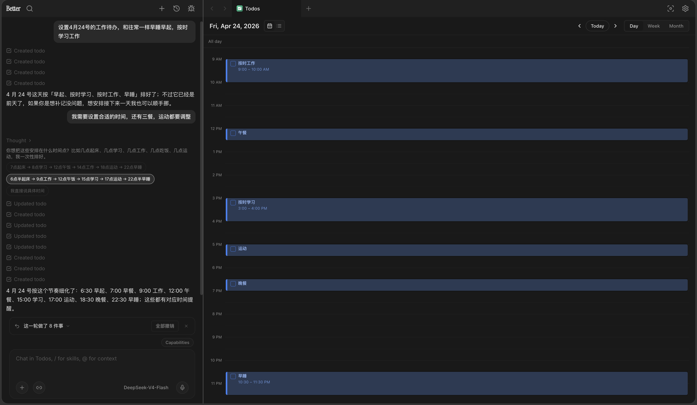
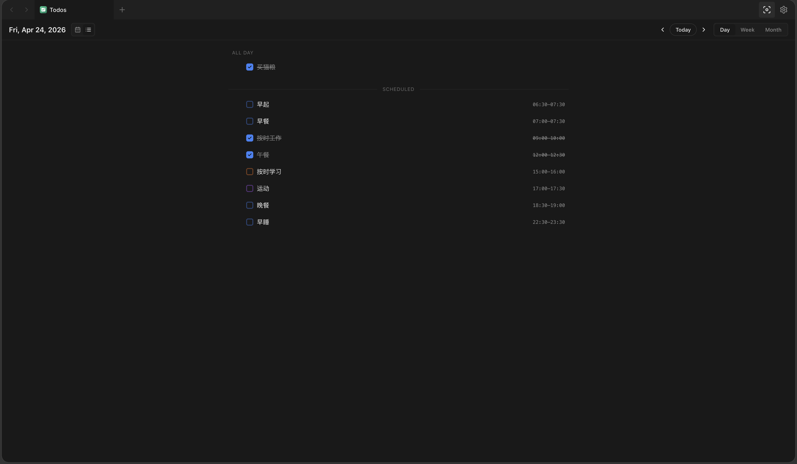
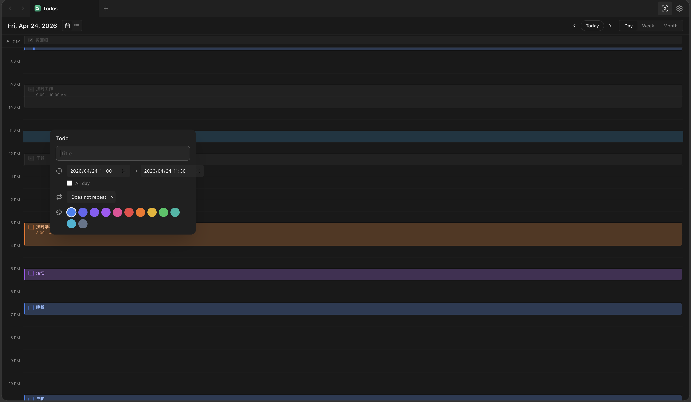
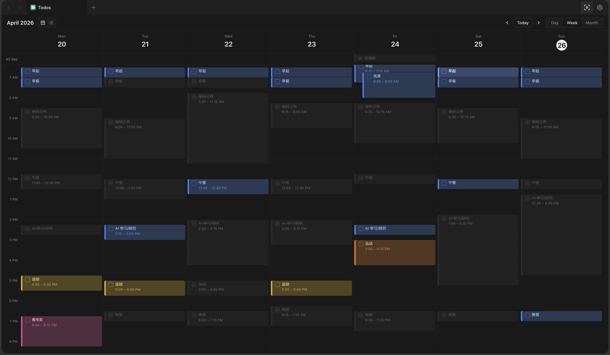
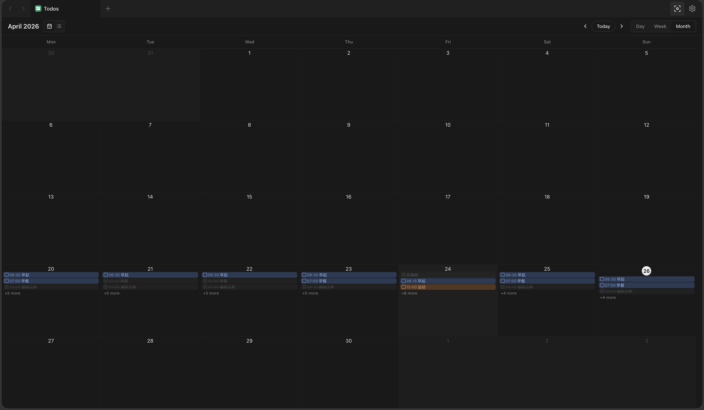

# Calendar

Plan your day, week, and month from chat, then keep every scheduled task visible inside Better.

[中文](./README.zh-CN.md)

## Why It Helps

Calendar is built for the moment when a plan needs time. Add tasks in plain language, place them on a day or time block, and review everything from a focused list, day, week, or month view.

## What You Can Do

- Capture tasks with title, notes, priority, tags, subtasks, due dates, repeat rules, and reminders.
- Plan by time with calendar-aware day, week, and month views.
- Ask Better to find overdue work, reschedule a group, complete errands, or clean up a list.
- Keep status, priority, reminders, and context visible in the same workspace.

## Example Requests

- “Remind me to renew the passport next Friday morning.”
- “Show overdue items and move the low priority ones to next week.”
- “Mark everything tagged errands as completed.”

## Interface Preview

Plan from chat into the calendar: Better can turn a natural-language schedule into real calendar items with times, reminders, and context.

Switch to a focused list when you want to scan what is done, what is scheduled, and what still needs attention.

Create or edit calendar items directly inside the calendar, including time range, repeat rule, color, and reminder settings.

Use the week view to balance recurring routines, deep work, errands, and flexible tasks across your schedule.

Zoom out to the month view to spot busy weeks and keep long-running plans visible.

## Chat Cards

Calendar now includes React chat cards in `ui/src/cards/` for structured responses from Better:

- Calendar item cards show one task with priority, status, schedule, reminders, and tags.
- Calendar list cards group multiple tasks with completed and pending counts.
- Schedule cards render day plans as a compact time-ordered agenda.
- Bulk action cards summarize completed, rescheduled, cancelled, or updated tasks.

These cards keep schedule results readable and actionable in chat instead of exposing raw JSON.

## Privacy

Calendar stores schedule data inside Better on your device. It does not contact external services and only uses its own connector storage.

## Maintainer Docs

Technical notes, build steps, and release guidance live in [docs/DEVELOPMENT.md](./docs/DEVELOPMENT.md). Store media and chat-card conventions live in [docs/STORE_ASSETS.md](./docs/STORE_ASSETS.md).
